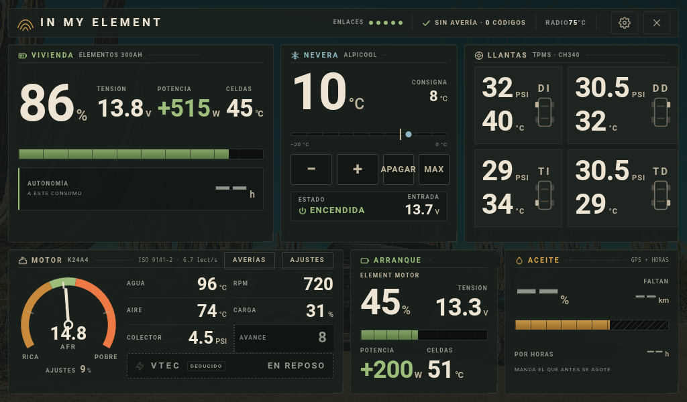
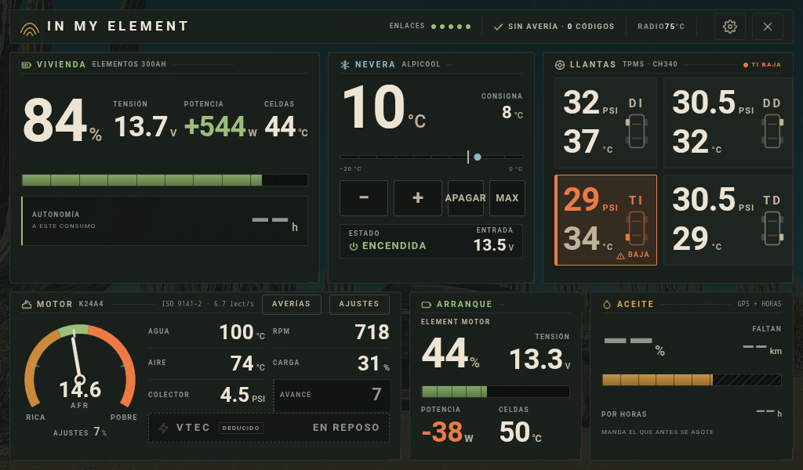
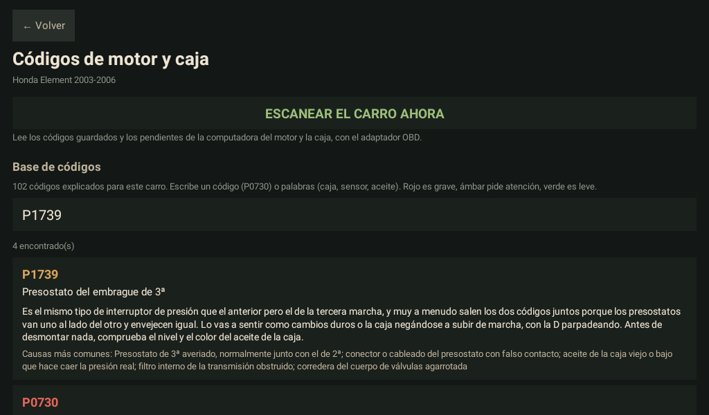
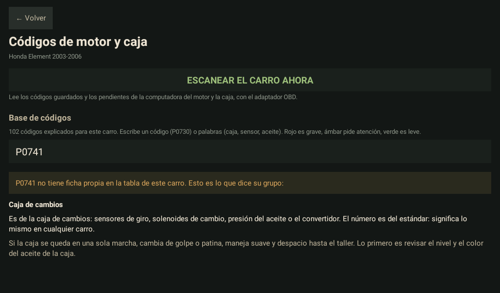
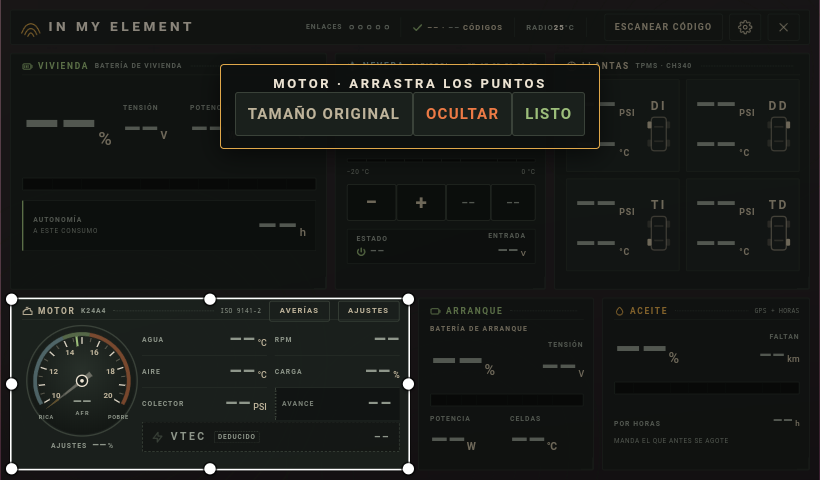
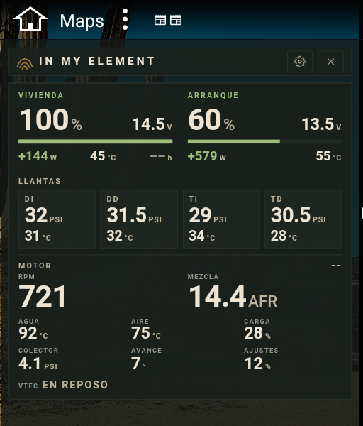
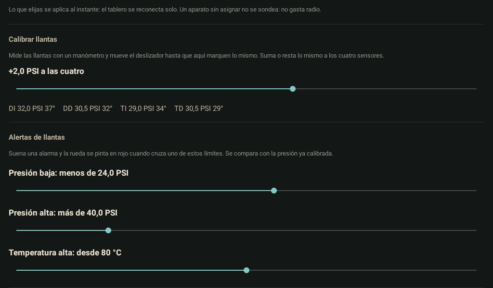

# In my element

Tablero en vivo para un **Honda Element 2003-2006** convertido en casa rodante,
corriendo en el radio Android del carro (Android 9, 1024×600). Lee el motor por
OBD-II, las dos baterías de litio y la refrigeradora por Bluetooth, la presión y
temperatura de las llantas por un receptor TPMS USB, y trae un inclinómetro para
parquear a nivel y dormir derecho. Todo en una pantalla, sin internet.



*Captura real del radio, con el motor en ralentí, del reparto anterior: todavía
con las baterías en dos cuadros, el del aceite y el reloj de mezcla viejo. Las
MAC de los aparatos van tapadas. La captura del reparto actual —un cuadro de
baterías y el inclinómetro— se toma del radio en cuanto esté en línea.*

## Qué hace

**Motor (OBD-II, ISO 9141-2).** Agua, aire, carga, presión del colector, avance,
ajustes de combustible y revoluciones. La **mezcla real** (AFR) sale de la sonda
de banda ancha del K24A4 (PID 0134) y se pinta en un reloj analógico: escala
graduada, zonas rica / estequiométrica / pobre y una aguja que se desliza con
inercia, como la de un instrumento de verdad. El VTEC se deduce de rpm y carga.

**Baterías de litio (BMS JBD por Bluetooth LE).** Las dos en un solo cuadro con
pestañas: cada pestaña dice el % de su batería —no se pierde ninguna de vista— y
el cuerpo enseña la elegida: carga, tensión, potencia con signo (verde entra,
rojo sale), temperatura, y la autonomía de la vivienda o la corriente del
arranque.

**Inclinómetro, para dormir derecho.** Inspirado en el de las Montero de los
ochenta: dos esferas de cara negra con bisel cromado y escala ámbar, y el
dibujo de la Element que se inclina de verdad —de perfil para adelante y atrás,
por detrás para los lados—, amortiguado como un instrumento de líquido. Cada
esfera dice su ángulo con un decimal, y al lado dice si está **nivelada** y
cuántos centímetros subir cada lado, calculado con la batalla (2,575 m) y la vía
(1,58 m) de la Element. Usa el sensor del radio solo mientras se mira, y se pone
a cero en Ajustes con la camioneta en plano.

**Refrigeradora (Alpicool por Bluetooth LE).** Temperatura, consigna, encendido y
modo eco, con mandos para subir, bajar y apagar.

**Llantas (receptor TPMS USB, CH340).** Presión y temperatura de las cuatro.
- Calibración con un solo deslizador que suma o resta a los cuatro sensores
  (mides con un manómetro y dejas que marquen lo mismo).
- **Alertas configurables** de presión baja, presión alta y temperatura alta,
  comparadas contra la presión ya calibrada. Suenan como alarma aunque el
  tablero esté cerrado, y se retiran solas cuando la llanta se recupera.
- Detector de pinchazo: una caída rápida avisa aunque no haya cruzado el límite.



*Captura real: el límite de presión baja subido a 30 PSI para probarlo; la
trasera izquierda, a 29, se pinta en rojo y la cabecera la nombra.*

**Escanear código.** Un botón en la cabecera, junto a la tuerca:
- lee los códigos guardados y los pendientes de la computadora del motor y de
  la caja automática;
- trae una base de **102 códigos** del motor y la caja, cada uno explicado en
  español sencillo, con su gravedad y sus causas probables, agrupados por
  sistema y con buscador (por código o por palabras, sin importar tildes);
- un código que no está en la base no sale pelado: se explica su grupo por la
  estructura del código (SAE J2012) y qué conviene hacer.

| Un código de la base | Un código sin ficha propia |
|---|---|
|  |  |

**Bolsas de aire (SRS).** El OBD-II no llega a esa computadora, así que la app
explica cómo leer el código con el parpadeo de la propia luz y trae los 55
códigos de la bolsa de aire explicados.

**Cuadros a tu gusto.** Sostén el dedo sobre un cuadro: aparece un recuadro
blanco con puntos. Arrastra un punto para cambiarle el tamaño como quieras, o
arrastra el cuadro para moverlo. Solo cambia ese cuadro; los bordes se pegan a
los de los demás para que quede alineado. También se puede ocultar, y en
Ajustes se vuelve todo a como venía.



*El APK real en el emulador del radio, sin carro conectado (por eso los valores
salen en «––»): el motor seleccionado, con sus ocho puntos, y el reloj de
mezcla en reposo.*

**Pantalla dividida.** Con el mapa al lado, el tablero se vuelve un solo cuadro
con las dos baterías, las cuatro llantas y el motor, entero en media pantalla.



*Captura real del radio, en la mitad izquierda (la derecha era el mapa).*

**Aparatos elegidos, no escritos.** Ningún adaptador, batería ni refrigeradora
está escrito en el código: se eligen en Ajustes, con búsqueda en vivo. Si un día
cambias de OBD o de batería, eliges el nuevo y funciona.



*Captura real: la calibración de llantas con las cuatro presiones en vivo, y los
tres límites de alerta.*

## Reglas que no se rompen

- **Un dato que falta o que ya es viejo se pinta «––», nunca un cero ni un
  valor por defecto.** Un cero y un «no lo sé» significan cosas opuestas.
- **Nada se inventa.** La aguja de la mezcla descansa en el tope si no hay
  lectura; nunca marca un 14.7 que nadie midió.
- **El radio se cuida.** Un guardián térmico baja el ritmo de pintado y pausa
  el Bluetooth cuando el radio se calienta, y lo reanuda al enfriarse.
- **Ligera.** Sin AndroidX: el APK pesa unos 1,5 MB.

## Estructura

```
element/   la app: su perfil, su motor (K24A4), el tablero HTML, las tablas
           de averías del motor y la caja, y la de la bolsa de aire
comun/     la librería: Bluetooth, OBD, baterías, llantas, tablero, ajustes,
           diagnóstico. No sabe en qué carro corre: se lo dice la app al
           arrancar (Carro.instalar)
tools/     publicar una versión y anunciarla en la red local
```

## Construir e instalar

Requisitos: JDK 17, Android SDK 34 y Gradle 8.7. Un `local.properties` con la
ruta del SDK (`sdk.dir=...`).

```bash
gradle :comun:testDebugUnitTest :element:testDebugUnitTest
gradle :element:assembleRelease
adb install -r element/build/outputs/apk/release/element-release.apk
```

El APK de release se firma con el keystore de depuración de la máquina, que no
va en el repositorio. La auto-actualización solo acepta un APK firmado con el
mismo certificado que la app instalada.

## Actualizar el radio por la red

El radio busca en la red local un servidor que se anuncie con su palabra y se
baja la versión nueva solo:

```bash
tools/publicar.sh
python -m http.server 8000 -d build/publicar
python tools/anunciador.py
```

## Licencia

MIT. Ver [LICENSE](LICENSE).
